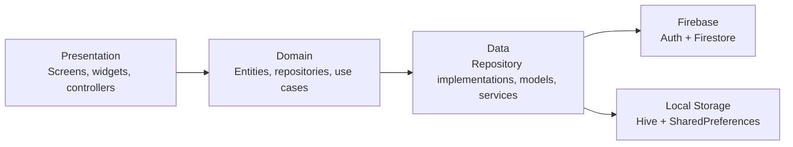

# Personal Analyzer

A modern Flutter habit tracking app focused on daily consistency, progress visibility, and lightweight personal analytics.

Built with `GetX`, `Firebase`, `Hive`, and a clean layered structure, Personal Analyzer lets users create custom habits, log progress across days, review trends, export reports, and sync status to Android home-screen widgets.

## Overview

Personal Analyzer is designed around three core flows:

- Track habits daily with flexible input types
- Analyze consistency with streaks, trends, and heatmaps
- Manage data securely with Firebase auth, local caching, and app lock

The app currently includes:

- Email/password authentication
- Google sign-in wiring
- Habit setup after registration
- Daily habit tracking by date
- Checklist, numeric, and option-based habits
- Analytics dashboard with weekly and long-term insights
- CSV and PDF export
- Biometric/device-lock app protection
- Android home-screen widgets with action sync
- Firestore offline persistence

## Feature Highlights

### Authentication and onboarding

- Email/password registration and login
- Google sign-in integration path
- Splash-based session restore
- First-run habit setup flow after account creation
- Firebase-backed user profile storage

### Habit tracking

- Create custom habits with:
  - checklist type
  - numeric value type
  - option selector type
- Add descriptions, units, options, colors, and icons
- Enable or disable habits without deleting them
- Reorder habits
- Track entries by selected date, not just today

### Analytics and insights

- Overall completion score
- Current and best streaks
- Weekly completion summary
- 7-day and 30-day trend tracking
- Weekday performance breakdown
- Top-performing habits
- 365-day history aggregation
- 90-day heatmap view

### Profile and data tools

- Update display name
- Choose avatar emoji
- Enable biometric/device app lock
- Export habit history as CSV
- Export a branded multi-page PDF report

### Android widget support

- Small, medium, and large widgets
- Widget-driven habit interactions
- Pending widget actions synced back into Flutter state
- Midnight reset scheduling and refresh support

## Architecture

The project follows a layered structure that separates UI, business logic, domain contracts, and data access:



### Layers

- `presentation/`: screens, reusable widgets, GetX controllers
- `domain/`: entities, repository contracts, use cases
- `data/`: repository implementations, models, cache, export, widget sync, local services
- `core/`: bindings, routing, theme, constants, validators, app-level utilities

## Project Structure

```text
lib/
├── core/
│   ├── bindings/
│   ├── errors/
│   ├── routes/
│   ├── theme/
│   └── utils/
├── data/
│   ├── cache/
│   ├── models/
│   ├── repositories/
│   └── services/
├── domain/
│   ├── entities/
│   ├── repositories/
│   └── usecases/
├── presentation/
│   ├── controllers/
│   ├── screens/
│   └── widgets/
├── firebase_options.dart
└── main.dart
```

## Tech Stack

### Core

- `Flutter`
- `Dart`
- `GetX`

### Backend and storage

- `firebase_core`
- `firebase_auth`
- `cloud_firestore`
- `Hive`
- `shared_preferences`

### UI and charts

- `google_fonts`
- `flutter_animate`
- `fl_chart`
- `skeletonizer`
- `persistent_bottom_nav_bar_v2`
- `font_awesome_flutter`

### Device features

- `local_auth`
- `share_plus`
- `printing`
- `pdf`

## Data Model

Firestore uses a user-scoped structure:

### `users/{userId}`

Stores the profile:

- `email`
- `name`
- `createdAt`

### `users/{userId}/parameters/{parameterId}`

Stores habit definitions:

- `name`
- `description`
- `type`
- `order`
- `isActive`
- `options`
- `unit`
- `icon`
- `color`
- `createdAt`

### `users/{userId}/entries/{entryId}`

Stores daily habit logs:

- `parameterId`
- `date`
- `value`
- `notes`
- `createdAt`

### Local storage

- `Hive`: analytics cache and streak cache
- `SharedPreferences`: app lock flag, avatar emoji, cached display name

## App Flow

1. App launches into splash screen
2. Existing session is checked with Firebase Auth
3. If app lock is enabled, biometric/device auth is required
4. New users register and create their first habits
5. Users log daily progress from the home tab
6. Analytics and exports are generated from synced history

## Screens

- `Splash`: startup auth and app-lock gate
- `Login`: email/password and Google sign-in
- `Register`: account creation
- `Setup Habits`: first-time habit creation flow
- `Home`: date-based daily habit logging
- `Analytics`: scorecards, charts, trends, heatmap
- `Profile`: habit management, exports, account and security settings

## Design Direction

The current UI uses a dark-first visual system with:

- deep navy background tones
- violet and teal accents
- glassy surfaces and subtle borders
- animated entrances and skeleton loading states

Key colors from the app:

- `#0D1117` background
- `#161C27` surface
- `#6C63FF` primary
- `#4ECDC4` secondary
- `#FF6B6B` error/accent

## Getting Started

### Prerequisites

- Flutter SDK installed
- A Firebase project
- Android Studio or VS Code
- An Android device/emulator for widget testing

### Setup

1. Clone the project.
2. Install dependencies:

```bash
flutter pub get
```

3. Configure Firebase for your app:

- Enable Firebase Authentication
- Enable Cloud Firestore
- Add your platform config files
- Regenerate `lib/firebase_options.dart` if needed:

```bash
flutterfire configure
```

4. Run the app:

```bash
flutter run
```

## Build

### Android

```bash
flutter build apk --release
```

or

```bash
flutter build appbundle --release
```

### iOS

```bash
flutter build ios --release
```

## Testing and Analysis

Run tests:

```bash
flutter test
```

Run static analysis:

```bash
flutter analyze
```
