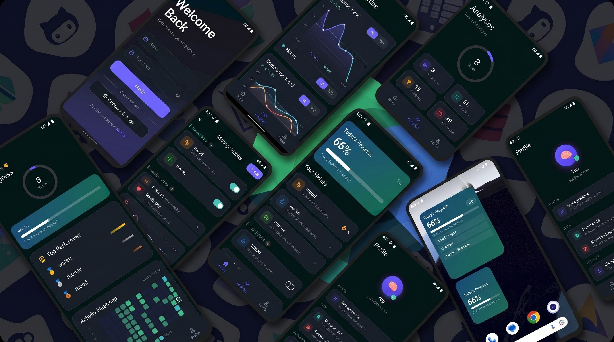
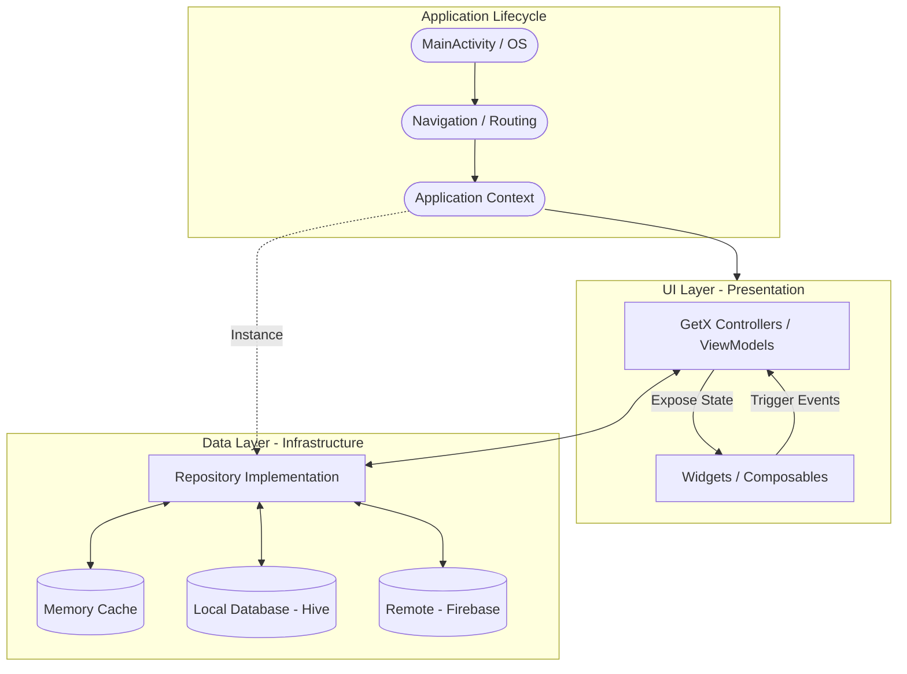
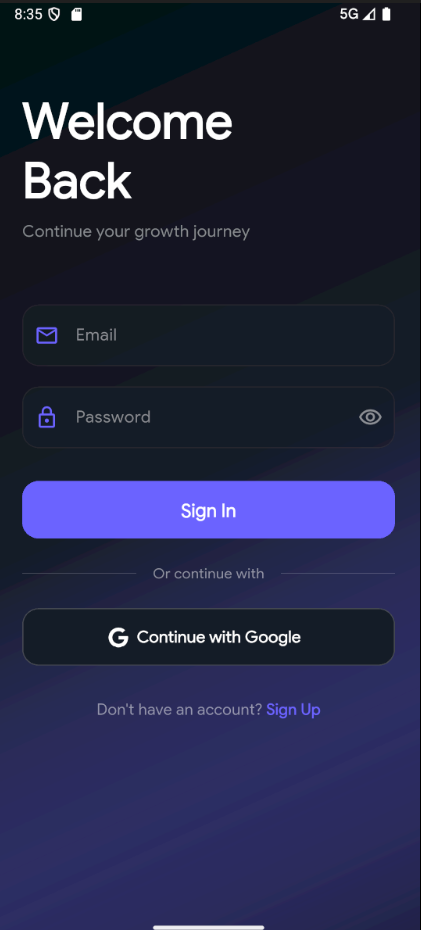
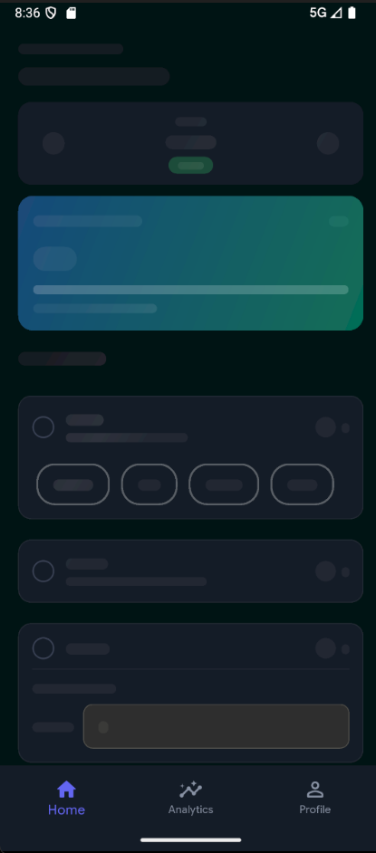
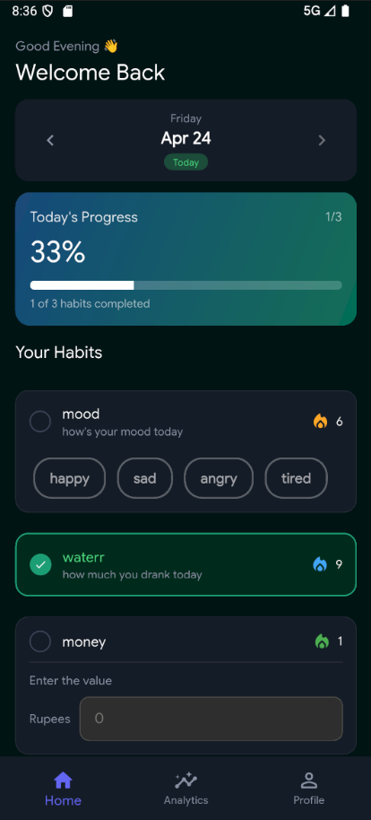
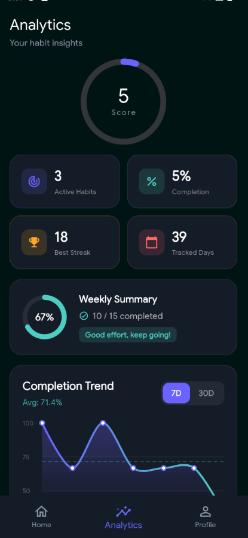
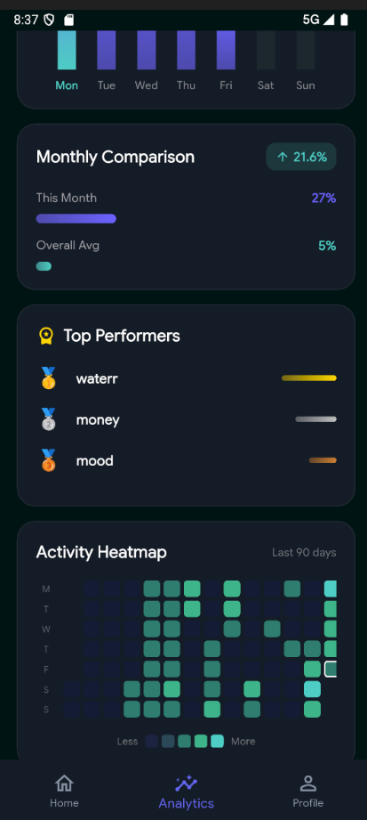
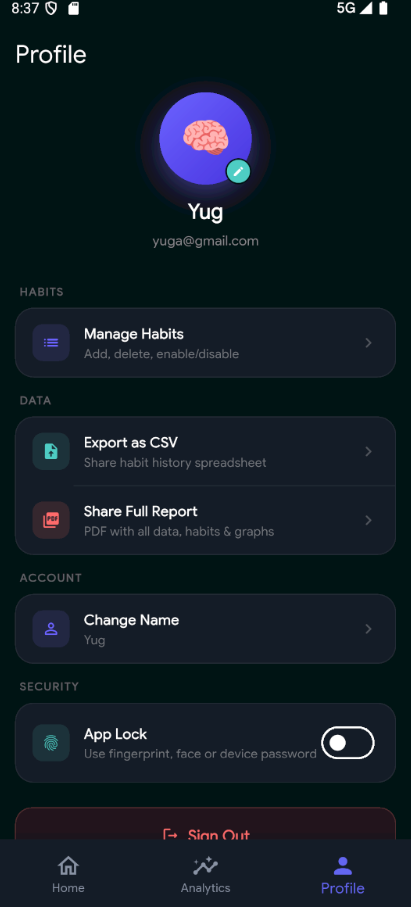
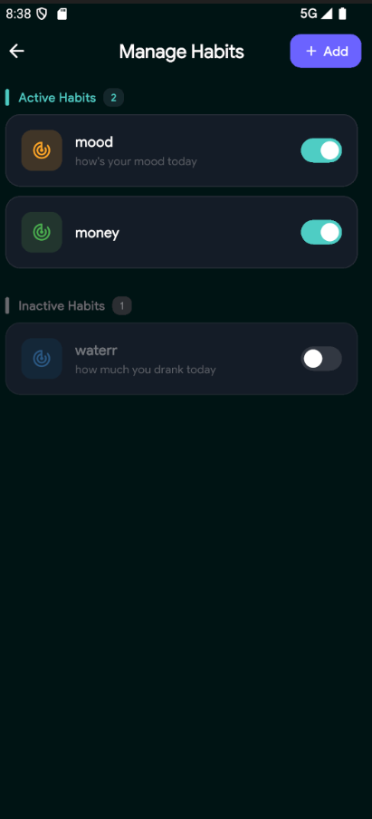
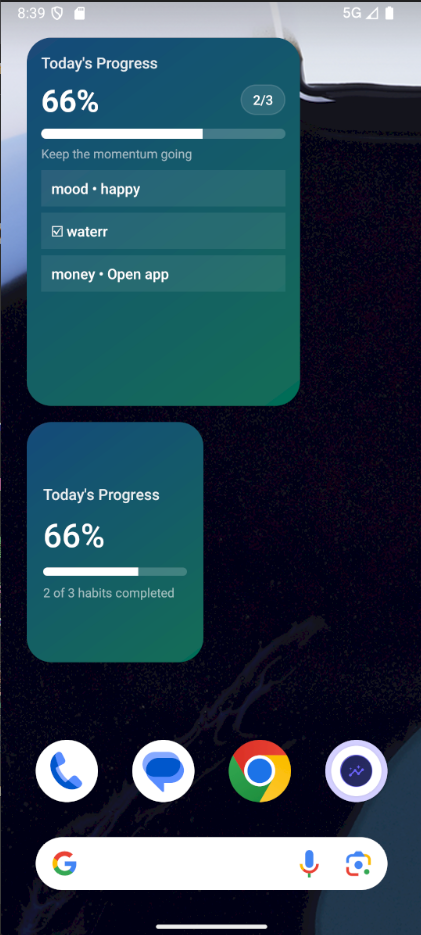

# Analyzer



A modern Flutter habit tracking app focused on daily consistency, progress visibility, and lightweight personal analytics.

Built with `GetX`, `Firebase`, `Hive`, and a clean layered structure, Personal Analyzer lets users create custom habits, log progress across days, review trends, export reports, and sync status to Android home-screen widgets.


## Download the APK
Access the latest APK for Personal Analyzer from the link below.

[]()

---

## Overview

Personal Analyzer is designed around three core flows:

- Track habits daily with flexible input types
- Analyze consistency with streaks, trends, and heatmaps
- Manage data securely with Firebase auth, local caching, cloud synchronization, multi device synchronization and app lock

The app currently includes:

- Email/password authentication
- Google sign-in wiring
- Habit setup after registration
- Daily habit tracking by date
- Checklist, numeric, and option-based habits
- Analytics dashboard with weekly and long-term insights
- CSV and PDF export
- Biometric/device-lock app protection
- Android home-screen widgets with action sync
- Firestore offline persistence

---

## Feature Highlights

### Authentication and onboarding

- Email/password registration and login
- Google sign-in integration path
- Splash-based session restore
- First-run habit setup flow after account creation
- Firebase-backed user profile storage

### Habit tracking

- Create custom habits with:
  - checklist type
  - numeric value type
  - option selector type
- Add descriptions, units, options, colors, and icons
- Enable or disable habits without deleting them
- Reorder habits
- Track entries by selected date, not just today

### Analytics and insights

- Overall completion score
- Current and best streaks
- Weekly completion summary
- 7-day and 30-day trend tracking
- Weekday performance breakdown
- Top-performing habits
- 365-day history aggregation
- 90-day heatmap view

### Profile and data tools

- Update display name
- Choose avatar emoji
- Enable biometric/device app lock
- Export habit history as CSV
- Export a branded multi-page PDF report

### Android widget support

- Small, medium, and large widgets
- Widget-driven habit interactions
- Pending widget actions synced back into Flutter state
- Midnight reset scheduling and refresh support

## Architecture

### Architecture Overview



### Layer Responsibilities

- **UI Layer (Presentation)**:
  - **Widgets**: Reusable UI components (Composables) that react to state changes.
  - **Controllers**: GetX Controllers acting as ViewModels, managing UI state and interacting with repositories.
- **Data Layer (Infrastructure)**:
  - **Repository**: The single source of truth for the UI. It orchestrates data flow between local and remote sources.
  - **Remote**: Firebase Auth and Cloud Firestore for cloud-based persistence.
  - **Database**: Hive for fast, offline-first local storage.
  - **Cache**: In-memory caching for performance-critical data (like analytics aggregations).
- **Domain Layer**: Defines entities and repository interfaces (contracts) that describe *what* the app does without knowing *how* data is fetched.
- **Core Layer**: Application-wide utilities, theme definitions, and dependency injection bindings.

## Project Structure

```text
lib/
├── core/
│   ├── bindings/
│   ├── errors/
│   ├── routes/
│   ├── theme/
│   └── utils/
├── data/
│   ├── cache/
│   ├── models/
│   ├── repositories/
│   └── services/
├── domain/
│   ├── entities/
│   ├── repositories/
│   └── usecases/
├── presentation/
│   ├── controllers/
│   ├── screens/
│   └── widgets/
├── firebase_options.dart
└── main.dart
```

## Data Model

Firestore uses a user-scoped structure:

### `users/{userId}`

Stores the profile:
```json
{
    "email": "[EMAIL_ADDRESS]",
    "name": "John Doe",
    "createdAt": "2022-01-01T00:00:00.000Z"
}
```

### `users/{userId}/parameters/{parameterId}`

Stores habit definitions:
```json
{
    "name": "Habit Name",
    "description": "Habit Description",
    "type": "Habit Type",
    "order": 1,
    "isActive": true,
    "options": ["Option 1", "Option 2", "Option 3"],
    "unit": "Habit Unit",
    "icon": "Habit Icon",
    "color": "Habit Color",
    "createdAt": "2022-01-01T00:00:00.000Z"
}
```

### `users/{userId}/entries/{entryId}`

Stores daily habit logs:
```json
{
    "parameterId": "Habit ID",
    "date": "Date",
    "value": "Value",
    "notes": "Notes",
    "createdAt": "2022-01-01T00:00:00.000Z"
}
```

### Local storage

- `Hive`: analytics cache and streak cache
- `SharedPreferences`: app lock flag, avatar emoji, cached display name


## Current Roadmap v0.1.0

- [x] Initialize core architecture with Firebase Auth, Cloud Firestore, and Hive local caching.
- [x] Implement secure authentication with Email/Password and Google Sign-In integration.
- [x] Develop dynamic habit management for custom types (Checklist, Numeric, Option Selector).
- [x] Build reactive Analytics dashboard with streaks, trends, and 90-day activity heatmaps.
- [x] Implement biometric and device-lock protection for enhanced privacy.
- [x] Create data export tools for CSV history and branded PDF reports.
- [x] Develop native Android home-screen widgets with action sync and midnight reset scheduling.
- [x] Optimize state management and caching for smooth UI transitions and offline-first performance.
- [ ] Create store publishing assets, banners, and privacy policy documentation.
- [ ] Enhance offline handling and network resilience for edge-case sync scenarios.
- [ ] Implement multi-language support.
- [ ] Add each habit analytic screen
- [ ] Add widget for iOS
- [ ] Add notification management to send reminders for each habit


## App Previews

| Login | Home (Loading) | Home | Analytics 1 |
| :---: | :------------: | :--: | :---------: |
|  |  |  |  |

| Analytics 2 | Profile | Manage Habits | Widget |
| :---------: | :-----: | :-----------: | :----: |
|  |  |  |  |

## Installation

```bash
git clone https://github.com/YugaJ7/CashCue.git
cd cashcue
flutter pub get
flutter run
```

---

## Build & Deploy

### Android

```
flutter build apk --release
# or
flutter build appbundle --release
```

### iOS

```
flutter build ios --release
```


## Contributions & Credits

This project is developed and maintained by [Yuga Jaiswal](https://github.com/YugaJ7).  
Feel free to fork, contribute, or give feedback!

---

## Feedback

If you have any ideas, feature requests, or spot a bug, feel free to open an issue or connect via [LinkedIn](https://linkedin.com/in/yuga-jaiswal).